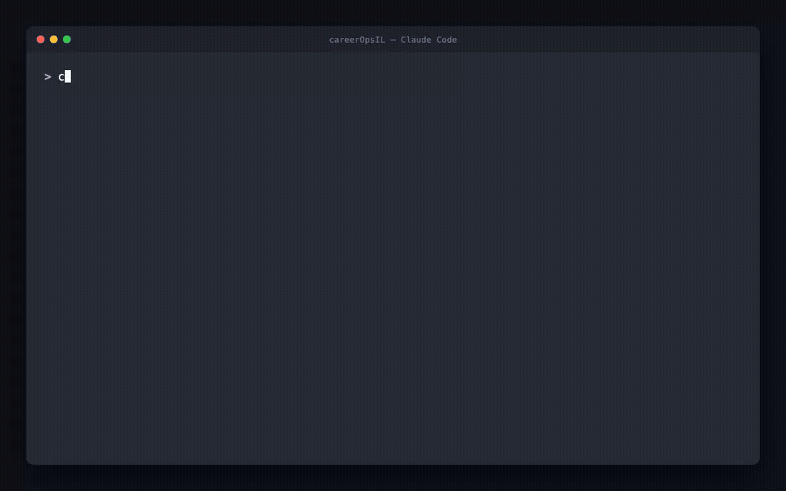

# Job Application Command Center

A self-hosted, terminal-based job-search system: track applications in plain-text Markdown,
scan job boards, evaluate postings against your CV with AI, and generate tailored
application materials — all reviewed by you before anything goes out. Nothing is ever
auto-submitted or auto-sent.

Two layers:
- **Deterministic tooling** — tracker, dedup, status changes, PDF rendering, scanning.
  Pure Python standard library plus a few small dependencies (see Setup).
- **AI features** — job evaluation, cover letters, portfolio, form-answer drafts. Use
  Gemini (free tier), a local Ollama, or any OpenAI-compatible endpoint — your choice, your
  key, your data stays local except for the actual model calls.


---

## Setup

```bash
python3 -m pip install -r requirements.txt      # or use .venv, see below
playwright install chromium                       # needed for PDF rendering + URL fetching
```

**AI features need Python 3.10+** (the `jobspy` multi-board search dependency requires it).
If your system Python is older, use the bundled virtualenv instead:

```bash
.venv/bin/python dashboard.py --path .
```

Everything below assumes you're running from this directory.

---

## Getting started

```bash
python3 dashboard.py --path .
```

First launch walks you through setup: paste a Gemini API key (free at
[aistudio.google.com/apikey](https://aistudio.google.com/apikey)), then point at a PDF
resume to auto-build `cv.md` — or skip either step (`Esc`) and do it by hand later.

Once set up, you land on the **pipeline screen** — your application tracker.

---

## Using it with Claude Code

The repo ships a `CLAUDE.md` and a `/careeropsil` skill, so you can drive everything
through natural language instead of remembering script names and flags.

**Interactive:**

```bash
cd careerOpsIL
claude
```

Then either type `/careeropsil` to load the router explicitly, or just talk — "scan
for new jobs," "evaluate this posting: `<url>`," "what's my tracker status," "draft a
cover letter for report #12." `CLAUDE.md` auto-loads for every session in this
directory, so plain requests work even without invoking the skill by name; `/careeropsil`
mainly makes the routing explicit and loads the safety notes up front.

**Headless / one-shot** (scripting, cron, CI):

```bash
cd careerOpsIL
claude -p "scan for new jobs and evaluate the top 3"
```

Runs the prompt once and exits — no interactive session.

**One thing to know:** `dashboard.py` is a Textual TUI — Claude won't drive it
interactively (it knows to call the underlying single-purpose scripts instead, e.g.
`scan.py --json`, `evaluate.py --json`, `tracker.py query --json`). For the visual
dashboard, run `python3 dashboard.py --path .` yourself as usual.

What's in scope for Claude here is documented in `CLAUDE.md` (operating rules — no
auto-submitting applications, no browser automation, tracker writes only through
`merge_tracker.py`/`set_status.py`) and `.claude/skills/careeropsil/SKILL.md` (the
full routing table from request → script).

---

## Screenshots

**1. The dashboard TUI** — navigate rows, switch tabs, cycle sort mode, toggle
grouped/flat view:


**2. Talking to it through Claude Code** — natural language in, a real read of
your own tracker data out, via the `/careeropsil` skill:


**3. The job-search function** — reopen scanned postings, filter by role
category, add straight to the tracker (it disappears from the pending list the
moment it's added):


**4. Evaluation reports** — score plus Blocks A–G (role fit, CV match,
positioning, comp research, personalization, interview prep, posting
legitimacy), reached straight from the row actions menu:


**5. Pipeline analytics** — funnel, score distribution, and conversion rates
computed live from the tracker:


**6. Multilingual by nature** — since it's just talking to an LLM, careerOpsIL
works in whatever language you use. Asked in Hebrew here: search the pending
jobs, pick the best fit, and draft a tailored resume summary — real output
from Claude reading the actual tracker and CV files:



---

## Architecture

Two layers, deliberately kept independent so the AI half is optional:

```
                 ┌─────────────────────────────┐
                 │        dashboard.py          │   Textual TUI — the one
                 │  (Pipeline / Report / Scan /  │   long-running process,
                 │   Portals / Cover Letter /…)  │   everything else is a
                 └───────────────┬───────────────┘   short-lived subprocess
                                 │ subprocess.run([sys.executable, "<tool>.py", ...])
        ┌────────────────────────┼────────────────────────┐
        ▼                        ▼                        ▼
 deterministic tools        AI-backed tools          shared libraries
 tracker.py                 evaluate.py               applications_table.py
 set_status.py              scan.py (jobspy path)      llm_providers.py
 merge_tracker.py           application_drafts.py      portals_config.py
 verify_pipeline.py         portfolio.py               pdf_backend.py
 stats.py, find.py, …       form_answers.py, …          canonical_states.py
        │                        │                        │
        └────────────────────────┴────────────────────────┘
                                 ▼
                   data/applications.md  (the only source of truth)
                   portals.yml · cv.md · .env
```

**Why subprocesses, not function calls.** Every scan/evaluate/PDF-rendering/AI
call from the dashboard runs as a real subprocess (`python3 tool.py ... --json`),
not an in-process import. Playwright's sync API and a couple of the scanning
libraries genuinely cannot run safely inside Textual's own asyncio event loop —
tried it, hit real hangs. A subprocess boundary sidesteps that entirely and
gives every long-running action a clean timeout and a JSON contract instead of
a shared-thread mess.

**Why the tracker is one Markdown table.** `data/applications.md` is the single
source of truth — a human-readable, git-diffable, grep-able table. Nothing
writes to it directly except `merge_tracker.py` (new rows, via a staged TSV in
`batch/tracker-additions/`) and `set_status.py` (status/note changes on an
existing row). Every other tool — the dashboard, `tracker.py`, `stats.py` — only
reads it. One writer path per kind of change means no two tools can
race-corrupt the table, and `verify_pipeline.py` / `dedup_tracker.py` /
`normalize_statuses.py` exist specifically to catch and repair drift if
something upstream misbehaves.

**Why the LLM layer is swappable.** `llm_providers.py` is the only module that
knows how to talk to a model — Gemini, a local Ollama, or any
OpenAI-compatible endpoint, selected by `LLM_PROVIDER` in `.env`. Every
AI-backed tool (`evaluate.py`, `application_drafts.py`, `portfolio.py`,
`form_answers.py`, `ai_setup.py`) calls through this one module instead of
embedding its own HTTP client, so switching providers is a config change, not
a code change.

**Why nothing auto-submits.** Cover letters, application emails, and form
answers are drafts written to `output/`, gated behind an explicit approval
keypress before a PDF even renders. There is no browser-automation path that
fills out a real application form — that was cut as a product decision, not a
missing feature (see `CLAUDE.md`).

---

## Dashboard keys

### Pipeline screen (main view)

| Key | Action |
|---|---|
| `↑↓` / `j k` | Navigate rows |
| `←→` / `h l` | Switch tabs (ALL / EVALUATED / INTERVIEW / APPLIED / TOP ≥4 / ...) |
| `/` | Live search/filter (`Enter` keep, `Esc` cancel, `Ctrl+U` clear) |
| `s` | Cycle sort mode |
| `v` | Toggle grouped/flat view |
| `C` | Toggle optional columns |
| `Enter` | Actions menu for the selected row (report, URL, resume, evaluate, status) |
| `c` | Change status |
| `o` | Open the report's URL in your browser |
| `d` | Open the row's generated PDF |
| `D` | Regenerate the row's PDF |
| `p` | Progress/funnel screen |
| `t` | Toggle language (partial Turkish support) |
| `P` | **Portals config editor** — target roles, locations, companies, job-board search |
| `S` | **Scan** — fetch new postings from tracked companies + configured job boards |
| `E` | **Evaluate** a job (paste URL or JD text) — score, report, tailored PDF, tracker entry |
| `L` | **Cover letter drafts** — multiple angles with an approval gate before rendering |
| `F` | **Portfolio PDF** — a narrative proof-points page built from your CV |
| `q` | Quit |

### On the Portals editor (`P`)

`↑↓` navigate · `a` add to current section · `Enter` edit · `x` delete · `Space` toggle
(company enabled / jobspy site) · `s` save · `Esc` back without saving.

Sections: target roles, excluded keywords, location always-allow/block/allow, tracked
companies (Greenhouse/Ashby/Lever), and job-board search (jobspy: enable, pick sites,
set search location/country, results-per-search).

### On the Scan results screen (`S`)

`↑↓` navigate · `Enter`/`o` open a posting's URL · `x` discard it from the pipeline ·
`Esc` back. Results are sorted newest-to-oldest by posting date.

### On the Cover Letter angles screen (`L`)

`↑↓` navigate · `Enter` **approve and render** the selected angle to PDF (nothing renders
until you pick one) · `m` also draft an application email for the same posting · `Esc`
back.

---

## What each tool does

### Tracker & pipeline (CLI tools, no AI)

| Tool | Purpose |
|---|---|
| `init.py` | Bootstrap `data/applications.md` + a `cv.md` stub |
| `tracker.py` | Query/export/delete tracker rows, rebuild the index |
| `find.py` | Resolve a number/company/role fragment to its full record |
| `add_entry.py` | Append a dated entry to `cv.md` / `article-digest.md` |
| `set_status.py` | The only sanctioned way to change a row's status |
| `merge_tracker.py` | Folds `batch/tracker-additions/*.tsv` into the tracker |
| `outcome.py` | Record how an application ended, archive artifacts |
| `verify_pipeline.py` | Read-only tracker health check |
| `normalize_statuses.py` | Fix non-canonical status text in place |
| `dedup_tracker.py` | Remove duplicate rows |
| `reconcile_pipeline.py` | Move batch-evaluated offers out of the pending pipeline |
| `tracker_sync_check.py` | Status-drift check against `data/active-interviews.md` |
| `stats.py` | Lifetime funnel/conversion stats |
| `reserve_report_num.py` | Hand out unique report numbers for parallel workers |
| `mark_pdf_ready.py` | Flag a tracker row's PDF as ready |
| `jd_capture.py` | Resolve an archived JD by report number |
| `archive_posting.py` | Save a live posting before it disappears (dry-run scope) |

### Scanning & discovery

| Tool | Purpose |
|---|---|
| `scan.py` | Fetch postings from tracked companies (Greenhouse/Ashby/Lever) + optional multi-board search (LinkedIn/Indeed/Glassdoor/Google/ZipRecruiter/Bayt via `jobspy`) |
| `portals_config.py` | Load/save `portals.yml` (used by the `P` TUI editor) |
| `validate_portals.py` | Lint `portals.yml` for schema issues |
| `detect_reposts.py` | Flag re-listed postings from scan history |
| `analyze_patterns.py` | Outcome pattern analysis, per-ATS advance rate |
| `upskill.py` | Skill-gap map from tracked reports |

### AI-powered evaluation & materials

| Tool | Purpose |
|---|---|
| `evaluate.py` | Paste a URL/JD → score (0-5), full report (role fit, CV match, positioning, comp research, personalization, interview prep, legitimacy check), tailored PDF, staged tracker entry. Includes a liveness gate that skips obviously closed/dead postings. |
| `application_drafts.py` | Multi-angle cover letter drafts (approval-gated PDF render) + draft-only application emails |
| `form_answers.py` | Draft answers to common ATS form questions (why this role/company, salary expectations, etc.), gated behind a score threshold so low-fit roles don't waste a call |
| `portfolio.py` | Narrative portfolio PDF compiled from your CV (distinct from the ATS-tailored resume) |
| `cv_intake.py` | Parse an uploaded PDF resume into `cv.md` (used by onboarding) |
| `llm_providers.py` | Gemini / Ollama / any OpenAI-compatible endpoint — set `LLM_PROVIDER=ollama` or `openai` in `.env` to switch (defaults to Gemini) |
| `eval_golden.py` | Offline golden-set eval harness for regression-testing scoring changes |
| `match_star.py` | Behavioral-question-to-STAR-story matcher (story bank format not yet supported) |

### Document generation

| Tool | Purpose |
|---|---|
| `generate_pdf.py` | Render an HTML file to PDF via headless Chromium |
| `generate_cover_letter.py` | Render a cover-letter JSON payload to PDF |
| `build_cv_latex.py` / `generate_latex.py` | LaTeX CV pipeline (build .tex, validate + compile) |
| `img_to_pdf.py` | Wrap a screenshot/image into a one-page PDF |

### Contacts, replies, follow-ups

| Tool | Purpose |
|---|---|
| `contacts.py` | Job-search phonebook → vCard export |
| `invite_match.py` | Match a pasted interview invite against the tracker |
| `paste_reply.py` | Manual input into the reply-classification pipeline |
| `followup_cadence.py` / `followup_seed.py` | Follow-up timing calculator + seeding |
| `assessment_log.py` | Log skills-assessment results |

### Setup & maintenance

| Tool | Purpose |
|---|---|
| `doctor.py` | Onboarding/setup status check |
| `update_system.py` | Version check / dismiss update notice |
| `cv_sync_check.py` | Sanity-check CV/profile setup |
| `verify_cv_facts.py` | Flag unsupported metric/employer/title claims in generated content |
| `jd_similarity.py` | Compare a new JD against a previous one for reuse/regeneration |

---

## Configuration files

- **`.env`** — `GEMINI_API_KEY` (or `LLM_PROVIDER=ollama`/`openai` + that provider's own
  key/model/URL vars). Gitignored, never commit this.
- **`portals.yml`** — target roles, location filters, tracked companies, job-board search
  settings. Gitignored (it's your personal targeting data) — copy `portals.example.yml`
  to get started, edit by hand, or via the `P` key in the dashboard.
- **`cv.md`** — your CV in plain Markdown. The single source of truth every AI feature
  reads from.

## File layout

```
data/applications.md      the tracker — the only source of truth
data/pipeline.md          inbox of scanned URLs pending evaluation
data/scan-history.tsv     scan dedup log
reports/                  evaluation reports, {num}-{company}-{date}.md
output/                   generated PDFs (tailored CVs, cover letters, portfolio, form answers)
batch/tracker-additions/  pending tracker rows waiting to be merged
jds/                      archived job-posting captures
cv.md                     your CV (source of truth for all AI features)
portals.yml               scan targets and filters
```

## Safety notes

- Nothing is ever auto-submitted, auto-sent, or auto-applied. Cover letters need an
  explicit approval keypress before rendering; emails and form answers are draft files
  you review and copy yourself.
- No browser automation fills out real application forms — that was deliberately scoped
  out as too risky for this tool to own.
- AI evaluation grounds every claim in your actual `cv.md` — the prompts explicitly
  instruct against inventing achievements, numbers, or employers not present in the
  source.

## Known gaps

- `match_star.py`'s real story-matching logic is unimplemented — the `interview-prep/
  story-bank.md` format hasn't been pinned down yet.
- Interview prep plans, practice Q&A, post-interview debriefs, salary-gap analysis,
  contract-clause review, and negotiation frameworks aren't built yet.
- Company research prompts and hiring-manager/recruiter contact discovery aren't built
  yet.
- `jobspy`'s Ollama/OpenAI code paths are implemented against each provider's documented
  API but not live-verified in this environment (no local Ollama, no OpenAI key
  configured here).
- Turkish is the only additional dashboard language, and only on the pipeline screen.
